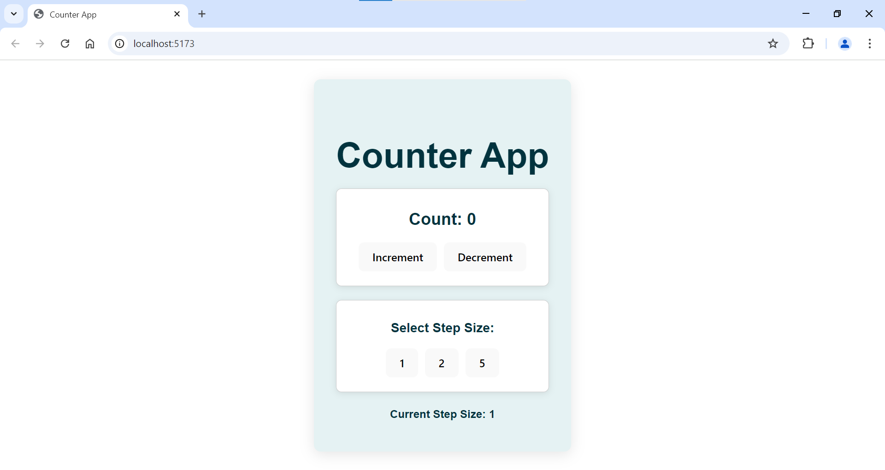

# Counter App with Vite and Docker

This is a simple counter app built with React and Vite, containerized using Docker. The app allows users to increment and decrement a counter and select step sizes.

  <!-- Replace with the actual path to your image -->

## Features

- Increment and decrement counter values.
- Select step size for increments and decrements.
- Built with Vite for a fast development experience.

## Getting Started

### Prerequisites

- [Docker](https://www.docker.com/get-started) installed on your machine.
- Basic knowledge of React and Docker.

### Clone the Repository

```bash
git clone https://github.com/yourusername/my-counter-app.git
cd my-counter-app
```

## Building the Docker Image

To build the Docker image for this app, run the following command in the root of the project directory:

```bash
docker build -t my-counter-app .
```

## Running the App

Once the image is built, you can run the app with the following command:

```bash
docker run -p 80:80 my-counter-app
```

You can now access the app by visiting `http://localhost` in your web browser.

## License

